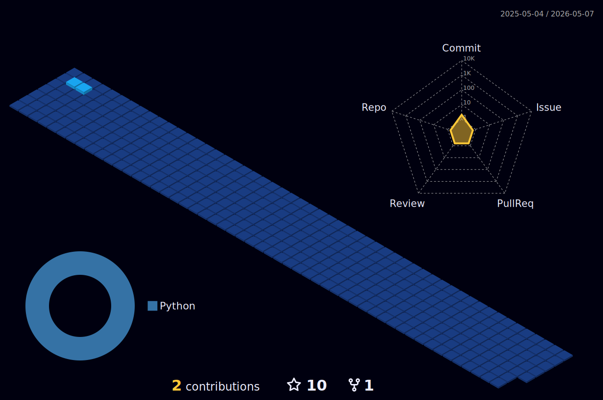

<h1 align="center">Hi there! I'm Emerson 	
</h1>

<ul>
	<li>&#127463;&#127479; I'm a brazilian self taught programing student.</li>
	<li>I'm not a fluently english speaker, but I can try it!</li>
	<li>Currently I'm focused in web development like back-end and front-end, but I'm open for experiences in other development areas.</li>
	<li>Be free to contact me at the end of this readme.</li>
</ul>

<h2 align="center">Tools</h2>

	
	
	
	
	
	
	
	
	
	
	
	
	
  
	
	
	
	
  	
	

<h2 align="center">Stats</h2>

  
  

	<h2>Contact me</h2>
	
	

